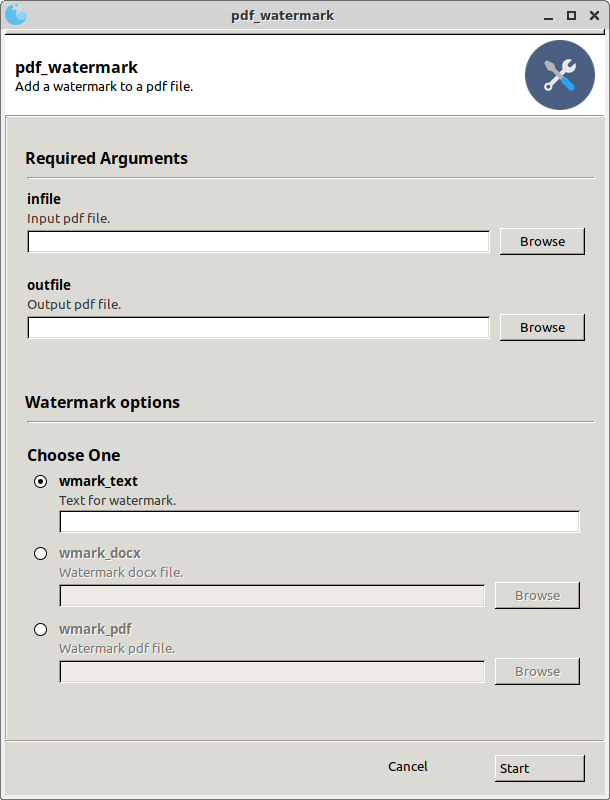

# pdf_watermark
Add a watermark to a pdf file.

## Requirements

* [pikepdf](https://pikepdf.readthedocs.io/en/latest/)
* [Gooey](https://github.com/chriskiehl/Gooey)
* [docx](https://python-docx.readthedocs.io/en/latest/)

The convertion from `docx` to `pdf` needs:

* [LibreOffice](https://www.libreoffice.org/) (Windows or Linux)

or

* Microsoft Word and [docx2pdf](https://pypi.org/project/docx2pdf/) (Windows only)

All the other requirements (e.g.: `os`, `pathlib`, `warnings`, `argparse`) are part of the standard python installation. Basically:

__Linux:__

```
conda create -n pdf gooey python-docx pikepdf
conda activate pdf
```

__Windows:__

```
conda create -n pdf gooey python-docx docx2pdf
conda activate pdf
pip install pikepdf
```

__Note:__ pikepdf anaconda [installation](https://anaconda.org/conda-forge/pikepdf) is only available in Linux and OSX. In Windows it should be installed with pip: `pip install pikepdf`

## How to use?

__CLI__

In the command line just run: `pdf_watermark <input.pdf> <output.pdf> -wt|-wd|-wp <arg>`

e.g.:

* Add a watermark using simple text:

```
pdf_watermark.py examples/document.pdf examples/document_text.pdf -wt "Watermark from text"
```

* Add a watermark using a `docx` file as template:

```
pdf_watermark.py examples/document.pdf examples/document_docx.pdf -wd examples/watermark_docx.docx
```

* Add a watermark using a `pdf` file as template:

```
pdf_watermark.py examples/document.pdf examples/document_pdf.pdf  -wp examples/watermark_pdf.pdf
```

__GUI__

Run the script with no arguments to open the GUI and then select the input and output pdf files.


